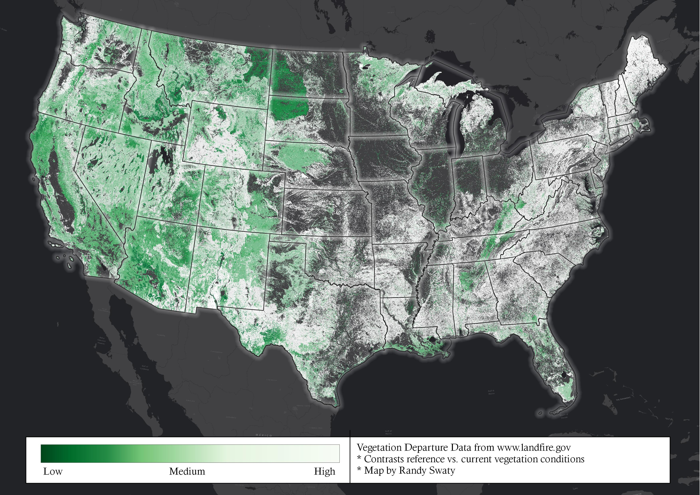
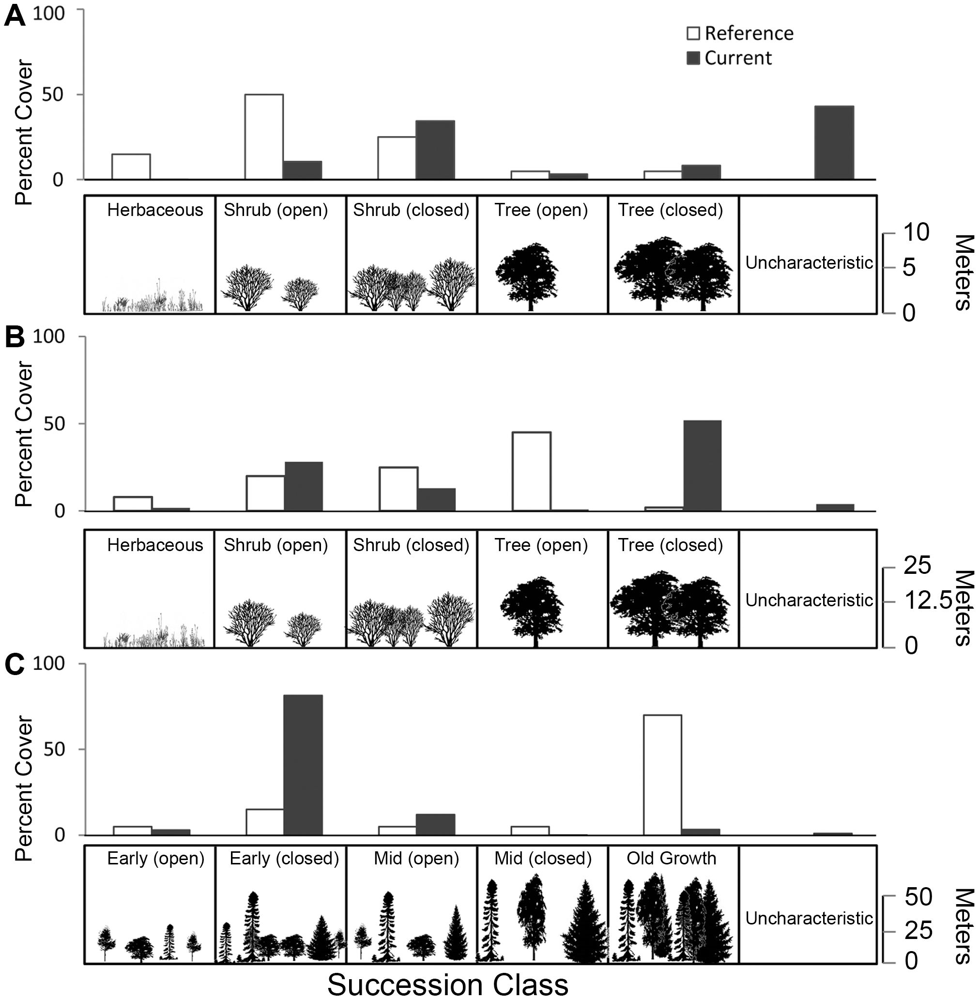

<style>
body {
    font-family: Georgia,"Times New Roman",Times,serif;
    font-size: 15px;
    line-height: 1.42857143;
    color: #000000;
    background-color: #ffffff;
}
</style>

<style>
.list-group-item.active, .list-group-item.active:focus, .list-group-item.active:hover {
    background-color: darkseagreen;
}
</style>


## What is VDEP?
VDEP, or Vegetation Departure is an ecosystem condition metric that compares modeled historical amounts (reference) of ecosystem succession classes (a.k.a. "seral states" or "developmental classes") to current.  The final output is a single number per ecosystem that ranges from 0 to 100.  When you download VDEP data from LANDFIRE (https://www.landfire.gov/vdep.php), this is what you get-that final number (VDEP math is pretty simple as in example table below for one imaginary unnamed ecosystem.  VDEP is **48** in the example).  

```{r echo=FALSE, message=FALSE, warning=FALSE}
library(readr)
library(DT)
vdepExample <- read_csv("vdepExample.csv")

datatable(vdepExample, options = list(dom = 't'))
```

<br>

When you map the VDEP data, you are essentially mapping 0 to 100 for all ecosystems within the area of interest such in this map of VDEP for the coterminous United States.  


<br>
```{r echo=FALSE, out.width="75%"}

```
<br>

## Since LANDFIRE delivers VDEP, why do we need to do anything?
While interesting and useful for general assessments, the downloaded VDEP data does not tell you which succession classes are over or under represented-you only get the **48** in the example table above.  To get at over and under representation we need to get the amounts of each succession class for the Biophysical Settings (ecosystems) that occur within our area of interest.

The figure below (from Swaty et al., 2011) illustrates this point.  In the three examples below we worked up data that separates out the amounts of succession classes allowing the reader to see where management work *might* need to happen (we do not provide prescriptions for what should be done-that is for local managers and stakeholders to do).  

<br>
```{r echo=FALSE, out.width="75%"}

```
<br>

Departure from reference conditions can be caused by (A) increases in uncharacteristic vegetation, as in Great Basin Salt Desert Scrub, (B) increases in closed canopy successional classes, as in Ozark Oak Woodland, or (C) increases in early successional classes, as in Cascades Western Hemlock Forest. These vegetation changes are the expected outcomes of biological invasion, fire suppression, and logging, respectively.

## How do we get the amounts of the succession classes for each ecosystem?
We need reference and current amounts of each succession class for each ecosystem.  Where do those come from? From www.landfire.gov .  `r emo::ji("smile")` 

* Reference amounts come from state and transition models.  Each "state" is a succession class and the transitions represent succession and disturbances.  For LANDFIRE all disturbances are "natural" (e.g., fire, wind, flooding).  To learn way more about this go to https://thenatureconservancy.github.io/landfiremodels/index.html. 

For our work here we will use the **refCon200.csv** (path to file is "rawData/refCon200.csv") file to get reference conditions.

* Current amounts come from a combine (in ArcGIS) of the Biophysical Settings data (spatial depiction of where ecosystems should be...an ecosystem habitat map of sorts) and the Succession Classes data.  To learn more about this combine operation in ArcGIS visit https://desktop.arcgis.com/en/arcmap/10.3/tools/spatial-analyst-toolbox/combine.htm . `r emo::ji("poop")` 

For our work here we will use the **combine200s.csv** (path to file is "rawData/combine200s") dataset.

BTW: what is all of this "200" business?  It refers to the most recent LANDFIRE dataset.  

## OK I have the two input datasets needed to calculate VDEP-now what?

In general data prep, then visualization.  More specifically:

### Data prep with the reference dataset

This dataset is not "Tidy".  What does Tidy mean?  It means that a dataset follows these 3 rules:

1. Each variable must have its own column.
2. Each observation must have its own row.
3. Each value must have its own cell.

You need to figure out what is going on with the reference data and fix it.  Here's what you need to do:

0. open and save a new r-script called "refConDataPrep"
1. **read (.csv) data**  
2. **view** the data
3. **create new dataframe** where you **pivot longer** so that the columns A-E are in one column named "sClass", and the values are in a column named "refPercent"
4. **review** new dataframe and "rename coloumns" if needed to make you happy.
5. admire your work

### Data prep with the current dataset

The main issue with this dataset is that it is confusing, and does not have all of the needed information.  Column names are not meaningful, and there are no percents per s-class for each ecosystem (Biophysical Setting).  Further, there are many columns that are not needed for VDEP analysis. 


0. open and save a new r-script called "sClsDataPrep"
1. **read (.csv) data**  
2. **view** the data
3. you need a dataframe with columns BPS_MODEL, LABEL and COUNT.  If you could simply verbally *tell* R what to do, what would you say?
4. **group_by then summarize** (dplyr library) to create a new dataframe with those columns
5. **mutate** creating new column with percents per sclass
6. **ask** could we be more efficient?  Did we annotate? Anything else to make formatting easier?  


